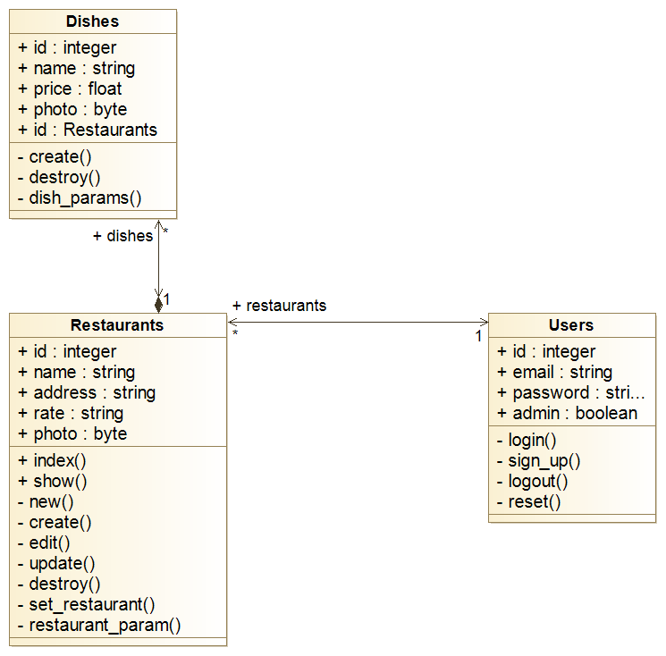

# README

## INTRODUCTION

Bienvenue dans [RubyFood](https://rubyfood-ak-sr.herokuapp.com/). Ce projet est un utilitaire développé avec le framework Ruby on Rails, que nous avons appris dans le cadre de notre cursus à Ynov Paris Campus. Lors du développement de nos nouvelles franchises de restaurants, nous avons besoin de créer, de modifier et de supprimer nos différents restaurants, ainsi que les plats qui y sont associés.

[RubyFood](https://rubyfood-ak-sr.herokuapp.com/) intervient à ce moment, où celle-ci nous permettra de faire tout cela via une interface claire, simple et réactive.

### INSTALLATION

Avant de commencer à utiliser [RubyFood](https://rubyfood-ak-sr.herokuapp.com/), il vous faudra l'installer sur votre machine en local. Pour cela, commencez par télécharger le code source du projet.

Avant d'aller plus loin, veuillez vous assurer que vous avez correctement installé [Ruby](https://www.ruby-lang.org), [Ruby on Rails](https://rubyonrails.org) et [Postgresql](https://www.postgresql.org/download/)
Version de Ruby : `2.7.2`

Ensuite, il vous faudra installer les mises à jour de la base de données via la commande
```
rails db:migrate
```

Toutefois, la base de données ainsi créée sera vide. Il est possible de démarrer l'application en l'état, mais nous avons pensé à inclure un jeu de données pour vous permettre de voir immédiatement le potentiel de l'application. Pour cela, il va falloir récupérer les données depuis la seed, avec la commande
```
rails db:seed
rails db:migrate
```

Enfin, l'application étant prête, il vous suffit de la lancer avec la commande
```
rails server
```

Pour commencer à utiliser l'application, vous devrez ensuite ouvrir votre navigateur internet favori et accéder à l'URL suivante

> http://127.0.0.1:3000


#### DIAGRAMME DECRIVANT LES DIFFERENTES TABLES




### UTILISATION

L'application se veut très simple d'utilisation, pour être accessible à la majorité des utilisateurs. Au lancement, vous arriverez sur la page d'accueil, et verrez la liste de tous les restaurants. Vous avez la possibilité de rechercher un restaurant spécifique via la barre de recherche, ou de créer un nouveau restaurant via le bouton en bas de liste.


Pour voir un restaurant plus en détails, il vous suffit de cliquer sur "Show" à coté du nom du restaurant. Sur cette seconde page, vous aurez tout d'abord un rappel des informations du restaurant, via son nom, son adresse et sa notation. En dessous, des boutons vous permettent de modifier ou supprimer ce restaurant, ou de revenir à la page précédente.


Enfin, en dessous, vous aurez la liste des différents plats du restaurant sélectionné. Comme pour les restaurants, vous avez également à disposition une barre de recherche et un formulaire pour créer un nouveau plat.
